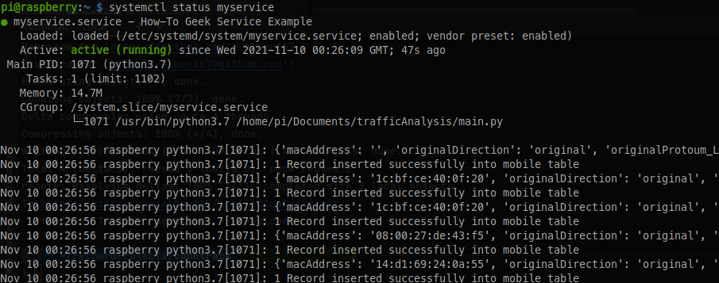

# Analizador de trafico DCP UDP

Se debe tener instalado los programas de docker y docker-compose en el sistema operativo linux

Todos los datos se estan enviando por defecto al servidor mio, el cual se puede cambiar para que envie al raspberry mismo o caso contrario a otro servidor

## Instalación para raspberry

1. Ejecutar el script script/raspberry.sh, este script instalará los programas de docker y docker-compose
2. Ejecutar docker-compose ubicandose en la ruta Docker del proyecto
```console
docker-compose build
dokcer-compose up -d
docker
```
4. Ejecutar el programa main.py
5. Instalar los requerimientos del sistema
```console
sudo apt-get install libpq-dev
pip3 install -r requirements.txt
```

## Creación del servicio en systemd
- Ejecutar los siguientes comandos

```console
touch /etc/systemd/system/myconntrack.service
nano /etc/systemd/system/myconntrack.service
```
- Copiar el contenido del archivo scriptsBash/myconntrack.service en el archivo myconntrack.service
- Ejecutar los siguientes comandos

```console
sudo systemctl list-unit-files --type-service
sudo systemctl daemon-reload
sudo systemctl enable myconntrack
sudo systemctl start myconntrack
sudo systemctl status myconntrack.service

```
- Verificar que el servicio este ejecutando


- tutorial https://www.howtogeek.com/687970/how-to-run-a-linux-program-at-startup-with-systemd/
